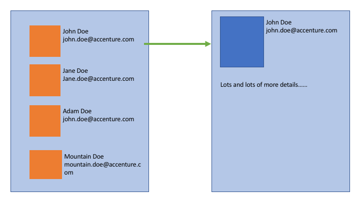

# Accenture Assessment

Answers for a B2B contract with Accenture. Note: this repo is public after email communication
approved it.

## **Task 2**

### You have the following mockup code in your project (which is used also in multiple other places):

```
class Provider {  
  /** 
   * Gets the weather for a given city 
   */  
  static getWeather(city) {  
    return Promise.resolve(`The weather of ${city} is Cloudy`)  
  };  
  /** 
   * Gets the weather for a given city 
    */  
   static getLocalCurrency(city) {  
     return Promise.resolve(`The local currency of ${city} is GBP`)  
   };  
   /** 
    * Given Longtitude and latitude, this function returns a city 
    */  
   static findCity(long, lat) {  
     return Promise.resolve(`London`)  
   };  
 };  
```

You need to write code which would:

1. Find and print in console the city located at latitude/longtitude 51.5074 and 0.1278 accordingly
2. Print in console the weather for the city located at lat/long = 51.5074 and 0.1278
3. Print in console in one line the weather and currency for a given city (London)

---

### **Answer**

**You may find all the answers for this task on the [`task-2.js`](answers/task-2.js) file**

---

</br>

## **Task 3**

### Look at this two-page app design for small company contact book

 </br> The management ask to use React and NodeJS as base
technology for this app (because of skills across the company). In future the company hope to build
more functions around this app. You are asked to provide initial technical design for this app which
should include the following points:

1. Frontend part:
   - Tools, frameworks, npm libraries you plan to use and why
   - Directory structure for source code folder
   - List of components which you’ll implement (with short description)
   - For one of the components also provide in which directory/-ies component’s file/-es will be
     located
   - Benefits/drawbacks comparing with traditional (not-SPA) app approach
   - Any other comments and suggestions
2. Backend part:
   - Short description of API – URI, format, why needed
   - Framework
   - Any other comments and suggestions

</br>

---

### **Answer**

**You can find the answer for this task in [`task-3.md`](answers/task-3.md)**

---

</br>

## **Task 4**

### You have been tasked with creating a helper function getProcessingPage, which should return one value as the output out of an array of data.

Each element of the input array has the following structure:

```
{  
   state: <String> // a state to go to  
   errorCode: <String> // optional error code  
}
```

The helper function will behave differently based on the states:

- state is 'processing'  delay by 2 seconds, then fetch the next state
- state is 'error' --> return the result object based on the error code provided (see below)
- state is 'success'--> the function should return the object:
  `{ title: 'Order complete' message: null }` Handling error codes:
- 'NO_STOCK' = return from the helper with an object:
  `{ title: 'Error page', message: 'No stock has been found' }` -'INCORRECT_DETAILS' = return from
  the helper with an object:
  `{ title: 'Error page', message: 'Incorrect details have been entered' }`
- null = return from the helper with an object: `{ title: 'Error page', message: null }`
- undefined = return from the helper with an object: `{ title: 'Error page', message: null }`

Example usage:

```
getProcessingPage([{ state: 'processing' }, { state: 'error' }])
```

This code should return after 2 seconds with the object: `{ title: 'Error page', message: null }`

### To-do:

- Provide the code and the code demonstrating how to run it

---

### **Answer**

**You may find the running code for this task on the [`task-4.js`](answers/task-4.js) file.**

**You can run it with NodeJS installed globally with `node answers/task-4.js`**

---

</br>

## **Task 5**

You are mid/senior developer in some big long-term project A. You will be participating in this
project for a long time. During the Scrum planning there was the following user story: As external
portal user When I open external portal and the portal has widget from the project’s A Then I should
see red alert if the amount of fuel consumed by cars in the fleet with id=121 more than 10k litres
during current month.

The information about the amount of litres will be receive through the following endpoint:
https://new.world.com/fleet/121 With the contract:
`{ “id”: number, //id of the fleet “litres”: number, //the amount of fuel consumed by fleet }`

Later our PO (product owner, who is sales consultant in other department) want to add some more
features to that widget and make it more customizable. But it will be much later. You agreed that
one of the junior developers will take that user story. User story is delivered for code review.
Junior developer has demonstrated it to PO and as PO opinion what he sees in the browser all is done
well.

Here will be the code from the junior developer. Please make code review (take in account that is
only the first of multiple future code reviews):

```
01:  import React, { useEffect, useState } from 'react';
02:
03:  function App() {
04:
05:      var [fuel, setFeul] = useState(0);
06:      var [alertText, setAlertTxt] = useState('Processing...');
07:
08:      useEffect(() => {
09:        fetch('https://new.world.com/fleet/121')
10:          .then(response => response.json())
11:          .then(json => {
12:            setFeul(json);
13:            console.log(json);
14:          })
15:      });
16:
17:      useEffect(() => {
18:        if (!fuel) setAlertTxt('Processing...'); else
19:        if (fuel.litres > 0) setAlertTxt('Need to buy more fuel'); else
20:        setAlertTxt('All is fine');
21:      }, [fuel])
22:
23:      return (
24:        <div>
25:          <h1 style={alertText == 'Need to buy more fuel'? {color:"red"}:{}}>{alertText}</h1>
26:        </div>
27:      );
28:
29:  }
30:
31:  export default App;

```

### To-do:

Please provide comments to the junior in the following format:

- Line number;
- Comment.


### **Answer**

**You may find the code review code for this task in [`task-5.js`](answers/task-5.md) file.**


---